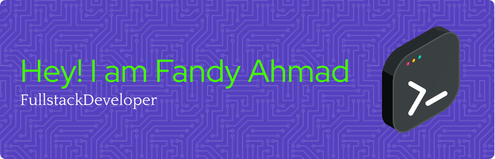

# Hi there 👋, I'm **Qrozyer**

Full‑Stack Developer (Backend, Frontend, Android)

---

## 🚀 About Me

- I'm a **fast learner** and self‑motivated developer who continuously explores new technologies, frameworks, update tech.
- With experience in both **development and visual design**, I bridge code and creativity to build solid and beautiful projects.
- Comfortable in both independent work and collaborative environments — adaptable, detail-oriented, and team-friendly.

---

## 🛠️ Tech & Design Stack

**Backend:** PHP · Laravel · Node.js · Express · Elixir · Phoenix · REST APIs  
**Frontend:** HTML · CSS · JavaScript · React.js · Responsive UI  
**Mobile / Android:** React Native · Android Studio  
**Design Tools:** Figma · Photopea · Canva  
**Design Skills:** Logo Design · Banner & Poster · Branding & Visual Assets  

---

## 🌟 Featured Projects

### [bimbel_kebidanan_app](https://github.com/Qrozyer/bimbel_kebidanan_app)  
A React Native mobile app designed for learning midwifery—implemented in TypeScript, UI‑driven navigation, and real‑time features.

### [bimbel_compass](https://github.com/Qrozyer/bimbel_compass)  
A frontend project built with React — interactive, responsive, and user-friendly dashboard UI for bimbel_kebidanan_app.

### [bimbel_user](https://github.com/Qrozyer/bimbel_user)  
A React-based web application (bootstrapped with Create React App) built for a user-facing educational platform. It features responsive UI powered by Tailwind CSS, modern front-end structure in JavaScript/TypeScript, and scalable React architecture. Ideal showcase of my ability to build production-ready web interfaces with clean and maintainable code. This is app for learning midwifery web version and responsive UI that have two version mobile and desktop.

---

## 💡 Why Work With Me?

- **Hybrid skill set**: I combine strong coding capabilities with graphic design sensibilities for cohesive and polished outcomes.
- **Learning mindset**: I pick up new frameworks and tools quickly, always staying updated and improving.
- **Collaborative & adaptive**: I thrive in team settings, communicate clearly, and welcome constructive feedback.

---

## 📫 Get in Touch

  
  
  

Feel free to ⭐ my repos, clone projects, or start collaborations.  
> *"Enjoy the process"* is my motto — I build better code, learn faster, and design smarter.

---

## 📊 Quick Overview

| 🧩 Attribute          | 📝 Description                                               |
|----------------------|-------------------------------------------------------------|
| Stack                | Full‑Stack · Android · Backend · Frontend · Graphic Design   |
| Soft Skills          | Fast Learner · Self‑Learner · Adaptive · Team-Oriented      |
| Style                | Clean · Responsive · Visual‑first                            |
| Passion              | Building tech‑driven, design‑informed, impactful projects   |

  
  
  
  

###

  
  
  
  
  
  
  
  
  
  
  
  
  
  
  
  
  
  
  
  
  
  
  
  
  
  
  
  
  
  
  
  
  
  
  
  
  
  
  
  
  
  
  
  
  
  
  

###

###

###

 

###

“Lagi mode hemat energi: ngoding sambil ngopi, desain sambil ngasal." - I'm Here For You  your partner Qrozyer

###

 

  
  
  
  
  

###